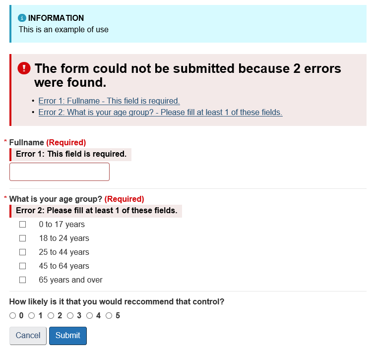

# Web Controls Library .NET

Custom web controls based on .net controls adapted for Web Experience Toolkit (WET)

>These controls work with async postback in Web Forms Project.

## Web Forms Components

1.  [WetSummary](#wetsummary)
2.  [WetTextBox](#wettextbox)
3.  [WetCheckBox](#wetcheckbox)
4.  [WetCheckBoxList](#wetcheckboxlist)
5.  [WetRadioButton](#wetradiobutton)
6.  [WetRadioButtonList](#wetradiobuttonlist)
7.  [WetDropDownList](#wetdropdownlist)
8.  [WetHyperLink](#wethyperlink)
9.  [WetProgressBar](#wetprogressbar)
10. [WetFileUpload](#wetfileupload)
11. [WetModal](#wetmodal)
12. [WetCallout](#wetcallout)
13. [WetAlert](#wetalert)
14. [WetButton](#wetbutton)
15. [WetImage](#wetimage)
16. [WetImageButton](#wetimagebutton)
17. [WetLinkButton](#wetlinkbutton)

## Author

**Jason Pesant** - *Initial Work* -

## Installation

* Add WetControls.dll to your project
* Add a reference for the dll file by using right-click on the project and then click on "Add reference"
* Select the dll file and add it to the project

### Option 1: Register tag in the page designer to use in one page

```aspx-csharp
<%@ Register TagPrefix="wet" Assembly="WetControls" Namespace="WetControls.Controls" %>
```

### Option 2: Register tag in Web.config to use in all pages
```xml
<pages>
    <controls>
	<add tagPrefix="wet" assembly="WetControls" namespace="WetControls.Controls" />
    </controls>
</pages>
```

### Example of use in designer

```aspx-csharp
<wet:WetAlert ID="wetAlert" AlertType="Info" Title="INFORMATION" Content="This is an example of use" runat="server"></wet:WetAlert>
<wet:WetSummary DisplaySummary="true" runat="server"></wet:WetSummary>
<wet:WetTextBox ID="txtFullname" IsRequired="true" IsLettersOnly="true" LabelText="Fullname" runat="server"></wet:WetTextBox>
<wet:WetCheckBoxList ID="chkAgeRange" IsRequired="true" LabelText="What is your age group?" runat="server">
    <asp:ListItem>0 to 17 years</asp:ListItem>
    <asp:ListItem>18 to 24 years</asp:ListItem>
    <asp:ListItem>25 to 44 years</asp:ListItem>
    <asp:ListItem>45 to 64 years</asp:ListItem>
    <asp:ListItem>65 years and over</asp:ListItem>
</wet:WetCheckBoxList>
<wet:WetRadioButtonList ID="rblRecommend" RepeatDirection="Horizontal" LabelText="How likely is it that you would reccommend that control?" runat="server">
    <asp:ListItem>0</asp:ListItem>
    <asp:ListItem>1</asp:ListItem>
    <asp:ListItem>2</asp:ListItem>
    <asp:ListItem>3</asp:ListItem>
    <asp:ListItem>4</asp:ListItem>
    <asp:ListItem>5</asp:ListItem>
</wet:WetRadioButtonList>
<wet:WetButton ID="btnCancel" EnableClientValidation="false" Text="Cancel" runat="server" />
<wet:WetButton ID="btnSubmit" ButtonType="Primary" OnClick="btnSubmit_Click" Text="Submit" runat="server" />
```



### Server Side Validation

```C#
	// validation of the whole page
	if (Page.IsWetValid())
	{
		// all WetControls.Interfaces.IWet is valid
	}

	// validation for wetcontrols individually
	if (txtFirstName.IsValid && txtLastName.IsValid)
	{
		// txtFirstName and txtLastName are valid
	}
```

## Documentation

<a name="wetsummary"></a>
### WetSummary Options
| Option    | Type | Default | Description |
| --- | --- | --- | --- |
| DisplaySummary | Boolean | True | Show or hide the summary |

<a name="wettextbox"></a>
### WetTextBox Options
| Option    | Type | Default | Description |
| --- | --- | --- | --- |
| LabelText | String | Empty | Text for the label associated to this control |
| LabelCssClass | String | Empty | Class applied to the label |
| Placeholder | String | Empty | Short hint displayed in the input field before the user enters a value |
| ValidationErrorMsg | String | Empty | Custom error message |
| State | ENUM_STATE | ENUM_STATE.Default | State of the control |
| GroupSize | ENUM_GROUP_SIZE | ENUM_GROUP_SIZE.Default | Class applied for the size of the input |
| IsRequired | Boolean | False | Mandatory form field |
| IsPhoneNumber | Boolean | False | Telephone number (US) validation |
| IsPostalCode | Boolean | False | Postal code (Canada) validation |
| IsEmail | Boolean | False | Email validation |
| IsGovernmentEmail | Boolean | False | Government of Canada email validation |
| IsUrl | Boolean | False | URL (IPv4) validation |
| IsDate | Boolean | False | Date (ISO) validation |
| IsTime | Boolean | False | Time validation |
| IsNumber | Boolean | False | Number only validation |
| MinNumber | Integer | 0 | Minimum number validation |
| MaxNumber | Integer | 0 | Maximum number validation |
| StepNumber | Decimal | 0 | Step number validation |
| IsAlphanumeric | Boolean | False | Alphanumeric validation |
| IsDigitsOnly | Boolean | False | Digits only validation |
| IsPrice | Boolean | False | Price only validation |
| IsLettersWithBasicPunc | Boolean | False | Letters with basic punctuation only validation |
| IsLettersOnly | Boolean | False | Letters only validation |
| IsNoWhiteSpace | Boolean | False | No white space validation |
| MinLength | Boolean | 0 | Minimum length validation |
| MinWords | Boolean | 0 | Maximum of x words validation |
| MaxWords | Boolean | 0 | Maximum of x words validation |
| EqualTo | String | Empty | Compare value with another control or html input by ID |
| EnableClientValidation | Boolean | true | Enable the client validation for this input |
| IsValid | Boolean | True | Server side validation with the sames rules of client validation |

<a name="wetcheckbox"></a>
### WetCheckbox Options
| Option    | Type | Default | Description |
| --- | --- | --- | --- |
| LabelText | String | Empty | Text for the label associated to this control |
| LabelCssClass | String | Empty | Class applied to the label |
| ValidationErrorMsg | String | Empty | Custom error message |
| IsRequired | Boolean | False | Mandatory form field |
| IsInline | Boolean | False | Applied class for inline control |
| IsValid | Boolean | True | Server side validation with the sames rules of client validation |
| EnableClientValidation | Boolean | true | Enable the client validation for this input |

<a name="wetcheckboxlist"></a>
### WetCheckBoxList Options
| Option    | Type | Default | Description |
| --- | --- | --- | --- |
| LabelText | String | Empty | Text for the label associated to this control |
| LabelCssClass | String | Empty | Class applied to the label |
| ValidationErrorMsg | String | Empty | Custom error message |
| IsRequired | Boolean | False | Mandatory form field |
| MinNumberFieldsRequired | Integer | 1 | Validates the minimum number of required fields |
| IsValid | Boolean | True | Server side validation with the sames rules of client validation |
| EnableClientValidation | Boolean | true | Enable the client validation for this input |

<a name="wetradiobutton"></a>
### WetRadioButton Options
| Option    | Type | Default | Description |
| --- | --- | --- | --- |
| LabelText | String | Empty | Text for the label associated to this control |
| LabelCssClass | String | Empty | Class applied to the label |
| ValidationErrorMsg | String | Empty | Custom error message |
| IsRequired | Boolean | False | Mandatory form field |
| IsInline | Boolean | False | Applied class for inline control |
| IsValid | Boolean | True | Server side validation with the sames rules of client validation |
| EnableClientValidation | Boolean | true | Enable the client validation for this input |

<a name="wetradiobuttonlist"></a>
### WetRadioButtonList Options
| Option    | Type | Default | Description |
| --- | --- | --- | --- |
| LabelText | String | Empty | Text for the label associated to this control |
| LabelCssClass | String | Empty | Class applied to the label |
| ValidationErrorMsg | String | Empty | Custom error message |
| IsRequired | Boolean | False | Mandatory form field |
| IsValid | Boolean | True | Server side validation with the sames rules of client validation |
| EnableClientValidation | Boolean | true | Enable the client validation for this input |

<a name="wetdropdownlist"></a>
### WetDropDownList Options
| Option    | Type | Default | Description |
| --- | --- | --- | --- |
| LabelText | String | Empty | Text for the label associated to this control |
| LabelCssClass | String | Empty | Class applied to the label |
| ValidationErrorMsg | String | Empty | Custom error message |
| EnableSelectText | boolean | Empty | Add select text to the first item |
| IsRequired | Boolean | False | Mandatory form field |
| IsValid | Boolean | True | Server side validation with the sames rules of client validation |
| EnableClientValidation | Boolean | true | Enable the client validation for this input |

<a name="wethyperlink"></a>
### WetHyperLink Options
| Option    | Type | Default | Description |
| --- | --- | --- | --- |
| ButtonType | ENUM_TYPE | ENUM_TYPE.Default | Class applied for the type of the input |
| ButtonSize | ENUM_SIZE | ENUM_SIZE.Default | Class applied for the size of the input |
| IsFullWidth | Boolean | False | Class applied "btn-block" |
| IsActive | Boolean | False | Class applied "active" |

<a name="wetprogressbar"></a>
### WetProgressBar Options
| Option    | Type | Default | Description |
| --- | --- | --- | --- |
| ProgressList | List<ProgressData> | Empty | Class applied for the type of the input |
| ProgressData.ValueNow | Decimal | 0 | Current value |
| ProgressData.ValueMin | Decimal | 0 | Minimum value |
| ProgressData.ValueMax | Decimal | 0 | Maximum value |
| ProgressData.ShowValueLabel | Boolean | False | Show label with current value |
| ProgressData.Striped | Boolean | False | Apply striped style |
| ProgressData.Animated | Boolean | False | Apply animated progress bar |
| ProgressData.MinWidth | Integer | 0 | Minimum width on progress bar |
| ProgressData.ProgressStyle | ENUM_PROGRESS_STYLE | ENUM_PROGRESS_STYLE.Default | Style applied on progress bar |
| ProgressData.ProgressWidth | Decimal | 0 | ValueNow / ValueMax * 100 |

<a name="wetfileupload"></a>
### WetFileUpload Options
| Option    | Type | Default | Description |
| --- | --- | --- | --- |
| LabelText | String | Empty | Text for the label associated to this control |
| LabelCssClass | String | Empty | Class applied to the label |
| ValidationErrorMsg | String | Empty | Custom error message |
| IsRequired | Boolean | False | Mandatory form field |
| IsValid | Boolean | True | Server side validation with the sames rules of client validation |
| EnableClientValidation | Boolean | true | Enable the client validation for this input |

<a name="wetmodal"></a>
### WetModal Options
| Option    | Type | Default | Description |
| --- | --- | --- | --- |
| Content | ITemplate | Null | Modal contents |
| HeaderText | String | Empty | Header text of the modal |
| ShowPopup | Void | Null | Display the modal |

<a name="wetcallout"></a>
### WetCallout Options
| Option    | Type | Default | Description |
| --- | --- | --- | --- |
| Title | String | Empty | Title text |
| Type | ENUM_CALLOUT_TYPE | ENUM_CALLOUT_TYPE.Default | Style applied to the control |

<a name="wetalert"></a>
### WetAlert Options
| Option    | Type | Default | Description |
| --- | --- | --- | --- |
| Title | String | Empty | Title text |
| Content | String | Empty | Content of the control |
| AlertType | ALERT_TYPE | ALERT_TYPE.Info | Style applied to the control |
| Dismissible | Boolean | False | Add close button for dismissible control |

<a name="wetbutton"></a>
### WetButton Options
| Option    | Type | Default | Description |
| --- | --- | --- | --- |
| ButtonType | BUTTON_TYPE | BUTTON_TYPE.Default | Type of the button |
| ButtonSize | BUTTON_SIZE | BUTTON_SIZE.Default | Size of the button |
| IsFullWidth | Boolean | False | Class applied "btn-block" |
| IsActive | Boolean | False | Class applied "active" |
| EnableClientValidation | Boolean | true | Enable the client validation for all the form |
| MessageConfirmation | String | Empty | Client confirmation before submit |

<a name="wetimage"></a>
### WetImage Options
| Option    | Type | Default | Description |
| --- | --- | --- | --- |
| Shape | ENUM_SHAPE | ENUM_SHAPE.Default | Style applied to the image |
| IsResponsive | Boolean | False | Class applied "img-responsive" |

<a name="wetimagebutton"></a>
### WetImageButton Options
| Option    | Type | Default | Description |
| --- | --- | --- | --- |
| ButtonType | BUTTON_TYPE | BUTTON_TYPE.Default | Type of the button |
| ButtonSize | BUTTON_SIZE | BUTTON_SIZE.Default | Size of the button |
| IsFullWidth | Boolean | False | Class applied "btn-block" |
| IsActive | Boolean | False | Class applied "active" |
| EnableClientValidation | Boolean | true | Enable the client validation for all the form |
| MessageConfirmation | String | Empty | Client confirmation before submit |

<a name="wetlinkbutton"></a>
### WetLinkButton Options
| Option    | Type | Default | Description |
| --- | --- | --- | --- |
| ButtonType | BUTTON_TYPE | BUTTON_TYPE.Default | Type of the button |
| ButtonSize | BUTTON_SIZE | BUTTON_SIZE.Default | Size of the button |
| IsFullWidth | Boolean | False | Class applied "btn-block" |
| IsActive | Boolean | False | Class applied "active" |
| EnableClientValidation | Boolean | true | Enable the client validation for all the form |
| MessageConfirmation | String | Empty | Client confirmation before submit |

## License

[](http://badges.mit-license.org)

This project is licensed under the MIT License - see the [LICENSE](LICENSE) file for details